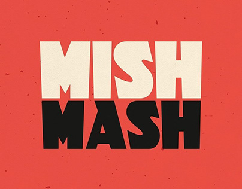

# Mishmash Kitchen ![Views][B0]
A feast for the hungriest in you

> This project is the result of a **code challenge**. Check all details in its [documentation][-1]!

[-0]: https://github.com/artu-hnrq/mishmash_kitchen "Project Repo"
[-1]: https://artu-hnrq.github.io/mishmash_kitchen "Challenge documentation"

[>1]: https://www.repostatus.org "Repo maintenance status"
[>2]: https://choosealicense.com/licenses/gpl-3.0/ "GPL 3.0 License description"

[B0]: https://views.whatilearened.today/views/github/artu-hnrq/mishmash_kitchen.svg?cache=remove "Repo views"
[B1]: https://www.repostatus.org/badges/latest/concept.svg "Repostatus badge"
[B2]: https://img.shields.io/github/license/artu-hnrq/mishmash_kitchen?color=green "License badge"

## Maintenance [![][B1]][>1]
This project is maintained by the author, [@artu-hnrq](https://github.com/artu-hnrq).  
It is a **proof-of-concept** and only intend to be a limited example.

## License [![][B2]][>2]
This project is published under the permissions established by [GNU General Public License v3.0][>2].
